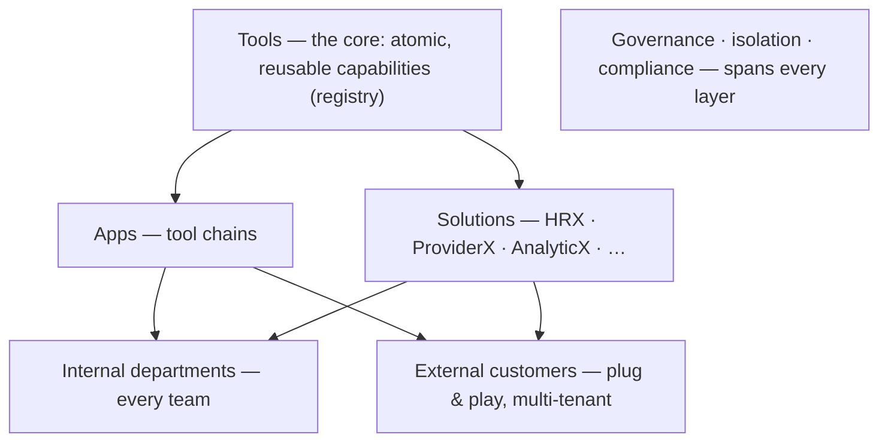
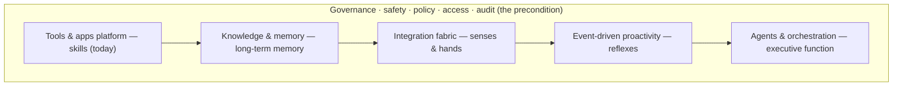

# Future of the platform — an AI-first solution platform

**Document type:** Vision and roadmap (forward-looking — not yet a build spec)
**Companion to:** `productivity-tools-platform-solution-architecture.md`
**Context:** Health-tech company
**Status:** Draft for discussion
**Date:** 15 June 2026

---

## 1. The north star

The platform becomes the engine for a portfolio of **AI-first solutions** — one for every department — built on a single shared foundation, and **productized so the same solutions can be sold, plug-and-play, to other companies.**

Two ideas sit underneath that sentence:

- **One platform, many solutions.** Rather than each department commissioning a bespoke system, every solution is assembled from the same shared primitives — tools, apps, agents, and a governed knowledge layer. The platform is the factory; the solution suites are its products.
- **Internal first, then a product.** The suites are proven by serving the company's own departments, then packaged for external customers as multi-tenant offerings. Selling externally reintroduces — deliberately, as a later phase — the multi-tenancy and commercial machinery that the original internal-only scope set aside.

Beneath the solutions, the platform is evolving from a tools executor into a company brain that *knows* the company's context, *reasons* about goals, and *acts* across its systems — safely, with humans in control where stakes are high. The solutions are how that brain reaches each department; the brain is what makes the solutions more than a bag of features.

---

## 2. The solution portfolio

**Tools are the core.** They are the atomic, reusable capabilities in the registry, and everything on the surface is composed from them. Apps and solutions are *siblings* on that surface — both are compositions of tools, served back to users — not a strict ladder where one stacks on the other:

- An **app** is a smaller composition — a chain of tools for a specific task.
- A **solution** (HRX, ProviderX, AnalyticX, …) is a larger, branded composition for a whole domain: a curated set of tools (and, where useful, apps) plus a domain knowledge pack, a branded surface, and entitlements, served back as a single offering.

This is what makes the suites plug-and-play: a solution is assembled from the shared tool core and provisioned to a department or customer, not built from scratch. The core stays constant; the surface offerings multiply.

### The initial portfolio

| Solution | Department / domain | What it is (AI-first) |
|---|---|---|
| HRX | HR | Recruiting, onboarding, employee and policy/benefits assistant, workforce analytics |
| ProviderX | Providers & management | Provider operations, network and credentialing support, performance dashboards, provider-facing assistants |
| AnalyticX | Analytics (any domain) | Self-serve analytics, natural-language querying over company data, automated insight and reporting |
| Clinical Intelligence | Clinical | Clinical summarization and decision support — advisory, human-in-the-loop; likely regulated |
| Clinical Encoder | Medical coding | Suggests ICD/CPT codes from clinical documentation, coding QA and audit support |
| Smart Claim Processing | Claims | Claims intake, validation, adjudication assistance, prior-authorization support |
| FWA Intelligence | Fraud, waste & abuse | Anomaly and pattern detection on claims, investigation support |
| *(extensible)* | Any department | New suites assembled from the same primitives — the portfolio is open-ended |

The list is deliberately open-ended: because every suite draws on the same engine, adding the next one is mostly curation and domain knowledge, not new platform.

### How a solution is assembled

A solution is curated from the tool core — directly, and via apps where a multi-step chain already exists — and wrapped with three things:

1. **Tools and apps** — the domain capabilities, drawn from the registry (e.g. coding tools for Clinical Encoder, an adjudication chain for Smart Claim Processing).
2. **A domain knowledge pack** — the curated context the suite reasons over (HR policies, provider networks, coding rulebooks, claims rules), from the knowledge layer with access-aware retrieval.
3. **A surface and entitlements** — a branded UI and/or chatbot scoped to the suite, generated from the same manifests, plus the policy for which tenants get it and what data and actions it may touch.

Because the unit of reuse is the tool, the same capability serves many solutions: a single de-identification tool or a document-extraction tool can sit inside HRX, ProviderX, and Smart Claim Processing at once. Improve the tool once, and every solution that uses it improves.

---

## 3. The engine beneath the solutions

Every suite is powered by the same evolving "brain." New capabilities stack on today's tools-and-apps platform, all under a governance spine that — for a health-tech company — is the precondition that gates what any solution may touch.

| Brain function | Platform capability | Status today |
|---|---|---|
| Skills / motor | Tools & apps registry | Exists |
| Long-term memory | Knowledge & data layer | To build (vector store is the seed) |
| Senses & hands | Integration fabric — connectors & events | Partial (port/adapter seam exists) |
| Executive function | Agents & orchestration | Seed exists (composition engine + chatbot planner) |
| Reflexes | Event-driven proactivity | To build |
| Self-reflection | Evaluation & monitoring | Seed exists (two-sided evaluation) |
| Conscience / control | Governance, safety, compliance, policy | Must lead — especially in health tech |

---

## 4. What we need to evolve (the capabilities the engine needs)

### 4.1 Knowledge & memory layer (long-term memory)
A governed semantic layer over the company's data and documents — a knowledge graph and/or retrieval layer giving the brain *context*, with source-of-truth, freshness, and **access-aware retrieval** (only ever returning what the asking identity may see). Each solution draws its domain knowledge pack from here. Adds institutional memory — past decisions, runs, and outcomes — so the brain accumulates rather than forgets.

### 4.2 Integration fabric (senses & hands)
Broad, governed connectors into company systems — data warehouse, EHR/EMR, CRM, ticketing, communications, billing — for reading and acting. Reuses the port/adapter and federated/remote-tool model; every connector is access-scoped and audited. This is what lets ProviderX touch provider systems or Smart Claim Processing touch claims systems without each suite reinventing integration.

### 4.3 Agents & autonomous orchestration (executive function)
Evolve from user-triggered chains to **goal-driven agents** that plan and execute multi-step work across tools, apps, and systems, under supervised autonomy. The composition engine and chatbot planner are the seed. Agents are governed like tools — manifests, scopes, evaluation, lifecycle — so autonomy never escapes the controls.

### 4.4 Event-driven proactivity (reflexes)
An event mesh so the brain reacts to events (a new claim, a flagged pattern, a threshold) and acts or notifies proactively, not only on prompt. Powerful and therefore tightly gated: proactive side-effecting actions follow the same human-in-the-loop rules as any high-stakes action.

### 4.5 Governance, safety & compliance (the precondition)
The load-bearing pillar, and in health tech it leads everything: PHI/PII handling and HIPAA / HITRUST / SOC 2 posture; consent and purpose-based access; de-identification and data residency; clinical safety with human-in-the-loop; model risk management and explainability. This is scoped with legal, compliance, security, and clinical-governance partners — not by the platform team alone. Clinical-facing suites (Clinical Intelligence, Clinical Encoder) may constitute regulated software (software as a medical device) requiring formal validation; that determination must be made early by the right people, because it changes the build.

### 4.6 Identity, access & policy engine
Fine-grained, attribute- and purpose-based access across all data and actions, with **every agent action checked against policy** (policy-as-code). Extends the per-tool permission scopes into an organisation- and tenant-wide policy layer — the bound on the brain's reach.

### 4.7 Decision lineage & audit
Every decision and action traceable end to end: inputs, data sources, tools used, reasoning, approver. Extends observability and metering into a full audit and lineage record — a necessity in a regulated, multi-tenant setting.

### 4.8 Continuous evaluation, monitoring & validation
Extend the two-sided evaluation into continuous behaviour monitoring, drift detection, and red-teaming — and, for clinical-facing suites, formal clinical validation. The bar rises with the stakes.

---

## 5. Productization & multi-tenancy (selling plug-and-play)

Selling the suites to other companies turns the platform into a multi-tenant product. This is the deliberate reversal of the original internal-only scope: the commercial machinery that was dropped for the pilot is reintroduced here, on purpose, once the suites are proven.

What productization requires:

- **Multi-tenancy with hard isolation.** Each customer — internal department or external company — is a tenant with isolated data, config, branding, and entitlements. In health tech, **per-tenant PHI isolation is a hard boundary**, not a soft partition.
- **Packaging, entitlements, and licensing.** Solutions become SKUs; tenants are provisioned with the suites they buy. The metering layer built from day one becomes usage-based billing.
- **White-labelling and onboarding.** Branded surfaces per tenant and a provisioning flow that makes "plug-and-play" real — a new customer turns on suites rather than commissioning a build.
- **Vendor obligations.** Selling health-tech AI externally means per-customer Business Associate Agreements, each customer's compliance posture, data residency per tenant, support and SLAs, and security certifications (e.g. HITRUST, SOC 2) becoming table stakes in the sales process.

The honest framing: going from an internal tool to a commercial product is a large organisational step — support, SLAs, go-to-market, and compliance-as-a-sales-requirement — not just a technical one.

---

## 6. Health-tech imperatives (preconditions, not features)

These gate *what each suite is allowed to touch*, per tenant, at every phase:

- PHI/PII protection and HIPAA / HITRUST / SOC 2 posture, with per-tenant isolation.
- Consent, purpose limitation, de-identification, and data residency.
- Clinical safety with human-in-the-loop for clinical and high-stakes actions.
- Regulatory classification (e.g. software as a medical device) and any required validation, especially for the clinical suites.
- End-to-end auditability and contestability of automated decisions.

The platform team owns the mechanisms; legal, compliance, security, and clinical governance own the rules. Build the mechanisms so the rules can be enforced — and keep any suite away from regulated data and clinical decisions until the controls for that tier are demonstrably in place.

---

## 7. Maturity roadmap

Two progressions advance together — **capability** (what the brain can do) and **reach** (who it serves). Capability must never outrun control, and reach must never outrun proof: nothing is sold externally that has not first been proven and isolated internally.

| Phase | Capability | Reach | Notes |
|---|---|---|---|
| 0 — today | Tools & apps platform | Pilot team | The current architecture |
| 1 — knows | Knowledge layer + governed connectors | First internal departments (e.g. HRX, AnalyticX) | Low-risk, non-PHI domains first |
| 2 — acts | Agents + event-driven proactivity, human-in-loop | All internal departments (full X portfolio) | Medium-risk; clinical suites human-in-loop, validated |
| 3 — product | Multi-tenancy, packaging, billing, white-label | External customers, plug-and-play | Only after isolation, governance, and validation maturity |
| 4 — brain | Company-wide intelligence layer | Internal + external, including regulated/clinical | The highest-stakes tier, last |

The sequence is deliberate: prove the suites internally on safe data, mature the governance and isolation, then productize for external sale, and only extend to the highest-stakes clinical and regulated domains once the controls exist.

---

## 8. Why the current architecture already points here

The expansion is mostly additive because the seeds are in place:

- The **registry of tools** is the core everything is composed from; a solution is a curated composition of tools (and apps), not a separate system.
- The **vector store** is the seed of the knowledge layer each suite's domain pack draws on.
- The **composition engine and chatbot planner** are the seed of agents and of suite assembly.
- **Metering** was built for cost attribution from day one — it becomes usage-based billing for external tenants.
- **Two-sided evaluation** is the seed of continuous monitoring and the clinical validation the regulated suites need.
- The **manifest's permission scopes and lifecycle** are the seed of the tenant-aware policy engine.
- The **port/adapter and federated model** is the integration seam connectors plug into.
- The **VM→AKS path** gives the runway from a single pilot to multi-tenant, mission-critical infrastructure.

Nothing here requires discarding the platform; the solution portfolio is what it grows into.

---

## 9. Honest caveats

- **Governance is the gating constraint, not a later add-on.** In health tech, multi-tenant and clinical reach are only worth building in their safe, compliant, auditable form. Capability or reach that outruns control is a liability.
- **Internal tool to commercial product is a large leap.** Support, SLAs, go-to-market, and security/compliance certifications become prerequisites, not afterthoughts — staff and budget for that shift explicitly.
- **Multi-tenant PHI isolation is unforgiving.** A cross-tenant data leak in health tech is catastrophic; isolation must be designed and proven, not assumed.
- **High-stakes errors.** Hallucination and automation bias are dangerous in clinical, coding, claims, and FWA contexts. Keep humans in control for clinical and high-stakes decisions, and design for contestability.
- **Per-customer compliance multiplies.** Each external customer brings its own regulatory posture, BAAs, and data-residency needs; the cost of serving the Nth customer is not zero.
- **Over-reliance and deskilling.** Suites that absorb judgement can erode the expertise they depend on; design them to augment people.
- **Cost and complexity scale with reach.** Revisit the financial case at each phase rather than assuming Phase 0 economics hold.

---

## 10. Summary

The platform's future is a portfolio of AI-first solution suites — HRX, ProviderX, AnalyticX, Clinical Intelligence, Clinical Encoder, Smart Claim Processing, FWA Intelligence, and more — each a packaged bundle of apps, agents, knowledge, and a branded surface built on one shared platform, and each plug-and-play enough to deploy to internal departments and, later, sell to external customers as multi-tenant products. Beneath the suites, the platform evolves into a company brain — knowledge, integration, agents, and proactivity — all under a governance spine that, for a health-tech company, is built first and gates everything. The path is phased so capability never outruns control and reach never outruns proof: prove the suites internally, mature governance and isolation, productize for external sale, and reach regulated and clinical domains last. Because the registry, knowledge seed, composition engine, metering, evaluation, and integration seams already exist, this is an evolution of the current architecture — but the version worth building is defined by its governance and isolation, not its ambition.
