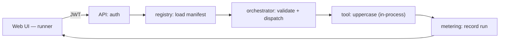

# Phase A — Implementation guide (foundations & walking skeleton)

**Document type:** Hands-on build guide (junior-friendly)
**Companion to:** `implementation-plan.md`, `ui-architecture.md`, `productivity-tools-platform-solution-architecture.md`
**Goal of Phase A:** prove the thinnest end-to-end path through every layer, and stand up the foundation everything else builds on.
**Status:** Draft
**Date:** 16 June 2026

---

## 0. What you will have built at the end

Two demos, both turned into automated tests:

- **A0 demo:** `docker compose up` brings the whole local stack online; a status page shows every dependency green; the API's Swagger UI is reachable.
- **A1 demo:** you log in via SSO, open the "Uppercase" tool in the web UI, type text, click Run, and see the uppercased result — and the run is counted in metering.

A1 is a *walking skeleton*: one trivial tool flowing through auth → API → registry → orchestrator → tool → metering → UI. Everything in later phases thickens this path; nothing replaces it.

### Technology choices (fixed for Phase A — don't deliberate, just use these)

| Area | Choice |
|---|---|
| API service | Python 3.12 + **FastAPI** (free OpenAPI/Swagger, Pydantic) |
| Schema validation | `jsonschema` |
| Datastore | PostgreSQL (metadata + metering) |
| Object store / cache | MinIO / Redis (provisioned now, used from Phase B) |
| Dev identity (SSO) | **Keycloak** (real OIDC, runs in compose) |
| Web app | **React + TypeScript + Vite + React Router** |
| Forms | `@rjsf/core` (React JSON-Schema Form) |
| Server state | TanStack Query |
| Styling | Tailwind + CSS-variable design tokens |
| Local orchestration | docker-compose + a `Makefile` |
| Tests | pytest (API), Vitest + Testing Library (web), **Playwright** (e2e) |
| CI | GitHub Actions |

> **Deliberate Phase-A simplification:** the gateway, registry, orchestrator, and worker are built as *modules inside one FastAPI app* and the tool runs **in-process and synchronously**. The module boundaries match the future separate services; the async queue and a separate worker arrive in Phase B (B2). This keeps Phase A to one deployable while preserving the seams.

### Prerequisites to install

Docker + Docker Compose, Node 20+, Python 3.12, `make`. Verify: `docker --version`, `node --version`, `python3 --version`.

### The A1 request flow you're building



---

## Part 1 — A0: project setup & infrastructure

### Step 1.1 — Create the repo skeleton

```
platform/
├── Makefile
├── docker-compose.yml
├── .env.example
├── contracts/
│   └── manifest.schema.json
├── services/
│   └── api/
│       ├── pyproject.toml
│       ├── app/
│       │   ├── main.py
│       │   ├── config.py
│       │   ├── health.py
│       │   ├── auth.py
│       │   ├── registry.py
│       │   ├── orchestrator.py
│       │   ├── metering.py
│       │   ├── db.py
│       │   └── tools/
│       │       └── uppercase.py
│       └── tests/
├── tools/
│   └── demo/uppercase/manifest.yaml
├── web/                      # added in Part 3
└── infra/
    └── keycloak/realm.json
```

✅ **Checkpoint:** the folder structure exists and is committed to Git.

### Step 1.2 — docker-compose for the local stack

```yaml
# docker-compose.yml (abridged)
services:
  postgres:
    image: postgres:16
    environment: { POSTGRES_USER: app, POSTGRES_PASSWORD: app, POSTGRES_DB: platform }
    ports: ["5432:5432"]
    healthcheck: { test: ["CMD-SHELL", "pg_isready -U app"], interval: 5s, retries: 10 }
  minio:
    image: minio/minio
    command: server /data --console-address ":9001"
    environment: { MINIO_ROOT_USER: app, MINIO_ROOT_PASSWORD: app12345 }
    ports: ["9000:9000", "9001:9001"]
  redis:
    image: redis:7
    ports: ["6379:6379"]
  keycloak:
    image: quay.io/keycloak/keycloak:25.0
    command: ["start-dev", "--import-realm"]
    environment: { KEYCLOAK_ADMIN: admin, KEYCLOAK_ADMIN_PASSWORD: admin }
    volumes: ["./infra/keycloak:/opt/keycloak/data/import"]
    ports: ["8080:8080"]
  api:
    build: ./services/api
    env_file: .env
    depends_on: { postgres: { condition: service_healthy } }
    ports: ["8000:8000"]
```

Copy `.env.example` to `.env` with the connection strings (Postgres, Redis, MinIO, and the Keycloak issuer URL `http://localhost:8080/realms/platform`).

The Keycloak realm (`infra/keycloak/realm.json`) defines: realm `platform`; a public client `platform-web`; a test user `dev` / `dev`; and a realm role `employee` assigned to `dev`. (Create it once via the Keycloak admin console, then export, or hand-write the minimal JSON.)

✅ **Checkpoint:** `docker compose up postgres redis minio keycloak` starts all four; the Keycloak admin console is reachable at `http://localhost:8080`.

### Step 1.3 — API skeleton with health

```python
# app/main.py
from fastapi import FastAPI
from .health import router as health_router

app = FastAPI(title="Platform API", version="0.1.0")
app.include_router(health_router)
```

```python
# app/health.py
from fastapi import APIRouter
from .db import ping_db
import redis, urllib.request

router = APIRouter()

@router.get("/health")
def health():
    checks = {
        "postgres": _safe(ping_db),
        "redis": _safe(lambda: redis.Redis(host="redis").ping()),
        "keycloak": _safe(lambda: urllib.request.urlopen(
            "http://keycloak:8080/realms/platform/.well-known/openid-configuration").status == 200),
    }
    ok = all(checks.values())
    return {"status": "ok" if ok else "degraded", "checks": checks}

def _safe(fn):
    try: return bool(fn()) or True
    except Exception: return False
```

Serve a tiny `/status` HTML page that fetches `/health` and renders each check green/red (this is the A0 visual).

✅ **Checkpoint:** `docker compose up` → open `http://localhost:8000/docs` (Swagger) and `http://localhost:8000/status` shows every dependency green.

🧪 **Test:** `tests/test_health.py` — call `/health` with the test client and assert `status == "ok"` and every check is `True`. Add a compose smoke step in CI that curls `/health` after startup.

---

## Part 2 — A1 backend: the walking skeleton

### Step 2.1 — The manifest meta-schema and the first tool

`contracts/manifest.schema.json` is a JSON Schema that every tool manifest must satisfy (id, version, name, description, kind, interface.input_schema, interface.output_schema, execution, permissions, binding). Keep it minimal for now.

`tools/demo/uppercase/manifest.yaml`:

```yaml
id: demo/uppercase
version: 0.1.0
name: Uppercase
description: Converts text to uppercase. Use to test the platform end to end.
kind: tool
category: demo
owner: platform
maintainer: dev
visibility: experimental
interface:
  input_schema:
    type: object
    required: [text]
    properties:
      text: { type: string, description: "text to convert" }
  output_schema:
    type: object
    properties:
      result: { type: string, description: "uppercased text" }
execution: { mode: sync, timeout_seconds: 5 }
permissions: { scopes: [], roles: { allow: [employee] } }
data_handling: { accepts: [public, internal], produces: [internal] }
binding: { type: internal }
runtime: { worker_pool: default }
```

✅ **Checkpoint:** the manifest exists and is valid YAML.

🧪 **Test:** `test_manifest_valid.py` — load `manifest.yaml`, validate it against `manifest.schema.json` with `jsonschema`, assert no errors.

### Step 2.2 — Registry: load and validate manifests

```python
# app/registry.py
import yaml, glob, jsonschema
from pathlib import Path

_SCHEMA = yaml.safe_load(Path("contracts/manifest.schema.json").read_text())
_TOOLS: dict[str, dict] = {}

def load_tools():
    for f in glob.glob("tools/**/manifest.yaml", recursive=True):
        m = yaml.safe_load(Path(f).read_text())
        jsonschema.validate(m, _SCHEMA)          # fail fast on bad manifest
        _TOOLS[m["id"]] = m

def list_tools(): return list(_TOOLS.values())
def get_tool(tool_id: str): return _TOOLS.get(tool_id)
```

Call `load_tools()` at startup; expose `GET /tools` and `GET /tools/{id}`.

✅ **Checkpoint:** `GET /tools` returns the uppercase manifest; a deliberately broken manifest makes startup fail loudly.

🧪 **Test:** `test_registry.py` — `list_tools()` contains `demo/uppercase`; feeding an invalid manifest raises a validation error.

### Step 2.3 — The tool and the orchestrator (sync, in-process)

```python
# app/tools/uppercase.py
def handle(input: dict, ctx=None) -> dict:
    return {"result": input["text"].upper()}
```

```python
# app/orchestrator.py
import jsonschema, time
from .registry import get_tool
from .tools import uppercase
from .metering import record_run

# Phase A: internal tools resolved from a simple map. (Phase B adds queue + workers.)
_HANDLERS = {"demo/uppercase": uppercase.handle}

def run_tool(tool_id: str, payload: dict, user: dict) -> dict:
    m = get_tool(tool_id)
    if not m: raise KeyError("unknown tool")
    # role check (caller roles ∩ allow)
    allowed = set(m["permissions"]["roles"]["allow"])
    if not (set(user["roles"]) & allowed): raise PermissionError("forbidden")
    # validate input
    jsonschema.validate(payload, m["interface"]["input_schema"])
    # dispatch by binding (only 'internal' in Phase A)
    t0 = time.time()
    out = _HANDLERS[tool_id](payload)
    # validate output
    jsonschema.validate(out, m["interface"]["output_schema"])
    record_run(tool_id, user["sub"], int((time.time()-t0)*1000), "success")
    return out
```

Expose `POST /tools/{id}/run` that calls `run_tool` and maps errors to status codes (404 unknown, 403 forbidden, 422 invalid input).

✅ **Checkpoint:** `POST /tools/demo/uppercase/run` with `{"text":"hello"}` returns `{"result":"HELLO"}`.

🧪 **Test:** `test_run.py` — happy path returns `HELLO`; `{"text": 123}` returns 422; missing role returns 403.

### Step 2.4 — Metering

Create a `runs` table (`id, tool_id, user_sub, duration_ms, status, created_at`). `record_run(...)` inserts a row; `GET /metering/summary` returns counts and average latency per tool.

✅ **Checkpoint:** running the tool twice makes `GET /metering/summary` show `demo/uppercase: 2`.

🧪 **Test:** `test_metering.py` — count before/after a run differs by one.

### Step 2.5 — Auth (OIDC against Keycloak)

```python
# app/auth.py
from fastapi import Depends, HTTPException
from fastapi.security import HTTPBearer
from jose import jwt
import urllib.request, json, functools

ISSUER = "http://localhost:8080/realms/platform"
bearer = HTTPBearer()

@functools.lru_cache
def _jwks():
    cfg = json.load(urllib.request.urlopen(f"{ISSUER}/.well-known/openid-configuration"))
    return json.load(urllib.request.urlopen(cfg["jwks_uri"]))

def current_user(token = Depends(bearer)) -> dict:
    try:
        claims = jwt.decode(token.credentials, _jwks(), audience="account",
                            options={"verify_aud": False})
    except Exception:
        raise HTTPException(401, "invalid token")
    return {"sub": claims["sub"],
            "roles": claims.get("realm_access", {}).get("roles", [])}
```

Add `user = Depends(current_user)` to `/tools/{id}/run` and `/metering/*`. Leave `/health` and `/tools` (catalog listing) readable per your preference, but require auth to *run*.

✅ **Checkpoint:** calling `/tools/.../run` without a token returns 401; with a valid token from Keycloak it succeeds.

🧪 **Test:** `test_auth.py` — no token → 401; a forged/expired token → 401. (Use a Keycloak token obtained via the password grant in an integration test.)

---

## Part 3 — A1 frontend: shell + foundation + runner

### Step 3.1 — Scaffold and the shell

```bash
cd web && npm create vite@latest . -- --template react-ts
npm i react-router-dom @tanstack/react-query react-oidc-context oidc-client-ts @rjsf/core @rjsf/validator-ajv8
npm i -D tailwindcss vitest @testing-library/react @playwright/test
```

Create `app/providers.tsx` composing: `ThemeProvider` (sets CSS-variable tokens + light/dark), `AuthProvider` (react-oidc-context pointed at Keycloak), `QueryClientProvider`, and the router. Create `app/layout` with a top bar (app name, user menu, logout) and a content slot.

✅ **Checkpoint:** `npm run dev` shows the shell with a "Log in" button.

### Step 3.2 — Auth foundation

Wrap react-oidc-context in `foundation/auth`: `useAuth()` (user, roles, login, logout) and `useCan(role)`. Configure the OIDC client with authority `http://localhost:8080/realms/platform`, client `platform-web`, redirect back to the app.

✅ **Checkpoint:** clicking "Log in" redirects to Keycloak; logging in as `dev`/`dev` returns to the app showing the username.

🧪 **Test:** component test that `useCan('employee')` is true when the auth context has that role.

### Step 3.3 — API client + server state

Generate types from the API's OpenAPI (`npx openapi-typescript http://localhost:8000/openapi.json -o foundation/api/schema.ts`). Wrap a typed `fetch` that attaches the access token. Add query hooks: `useTool(id)`, `useRunTool(id)` (a mutation). Set up the TanStack `QueryClient` in providers.

✅ **Checkpoint:** a quick console call of `useTool('demo/uppercase')` returns the manifest.

### Step 3.4 — Schema-driven form + JobRunner

In `foundation/forms`, wrap RJSF (`@rjsf/core` + `@rjsf/validator-ajv8`) styled with your tokens. Build `<JobRunner tool={manifest} />`: it renders a form from `tool.interface.input_schema`, on submit calls `useRunTool`, shows a running state, then renders the output (for Phase A, just show `result`; the file/download path comes in Phase B), or an error panel.

✅ **Checkpoint:** given the uppercase manifest, `<JobRunner>` shows a single "text" field and a Run button.

🧪 **Test:** component test — render `<JobRunner>` with the uppercase schema, assert one text input and a Run button appear.

### Step 3.5 — The runner module

Add a route `/tools/:id` in `modules/runner` that fetches the manifest with `useTool` and renders `<JobRunner>`. Add a nav link.

✅ **Checkpoint (A1 demo):** logged in, navigate to the uppercase tool, type `hello`, click Run, see `HELLO`. Open `/metering/summary` (or a tiny counter) and confirm the run was recorded.

🧪 **Test (e2e):** `tests/e2e/uppercase.spec.ts` (Playwright) — start from the app, log in through Keycloak (`dev`/`dev`), open the uppercase tool, enter text, run, assert the uppercased result is visible.

---

## Part 4 — CI

`.github/workflows/ci.yml` with three jobs:

1. **api** — set up Python, install, `ruff` lint, `pytest` (spin up Postgres as a service container).
2. **web** — set up Node, install, lint, `vitest`, `npm run build`.
3. **e2e** — `docker compose up -d`, wait for `/health` green, run Playwright, tear down.

✅ **Checkpoint:** a pull request runs all three jobs and they pass.

---

## 5. Definition of Done for Phase A

Phase A is done when **all** of these are true:

- [ ] `docker compose up` brings the stack up; `/status` is all green; Swagger at `/docs` works (A0 demo).
- [ ] Logged-in user runs the uppercase tool from the UI and sees the result; the run is metered (A1 demo).
- [ ] The UI foundation checklist from `ui-architecture.md` §9 is complete (shell, tokens, auth/roles context, generated client + Query, schema form + JobRunner, realtime abstraction stub, runner module).
- [ ] Auth is enforced on run/metering endpoints (401 without a token, 403 without the role).
- [ ] Manifests are validated against the meta-schema at startup and in CI.
- [ ] Both demos exist as automated tests; CI is green.

---

## 6. Common pitfalls

- **Keycloak issuer mismatch.** The token's issuer must match what the API expects. In compose, the API reaches Keycloak at `http://keycloak:8080` but the browser uses `http://localhost:8080`; align the issuer config (use `localhost` consistently for dev, or set Keycloak's hostname).
- **CORS.** The Vite dev server (`5173`) calling the API (`8000`) needs CORS enabled in FastAPI for dev.
- **Don't add the queue yet.** It's tempting to wire Redis as a job queue now — resist it; sync in-process is correct for Phase A and keeps the skeleton readable. The queue is Phase B (B2).
- **Don't hand-code the form.** Render it from the schema even though there's only one field — this is the habit the whole platform depends on.

---

## 7. Deferred to Phase B (do not build now)

Async jobs + message queue + a separate worker process; the real PDF→Excel tool with file upload/download (MinIO); the published SDK package; the catalog and dashboards modules; affected-only monorepo CI (Nx/Turborepo). Phase A intentionally stops at the walking skeleton.

---

## 8. Summary

Phase A delivers two demoable, tested milestones — a healthy local stack and a single tool running end-to-end through auth, registry, orchestrator, and metering, with the React shell and the six foundation pieces in place. Build it in order, stop at each checkpoint to confirm the visible result, and write the test before moving on. Everything in later phases thickens this skeleton; nothing replaces it.
