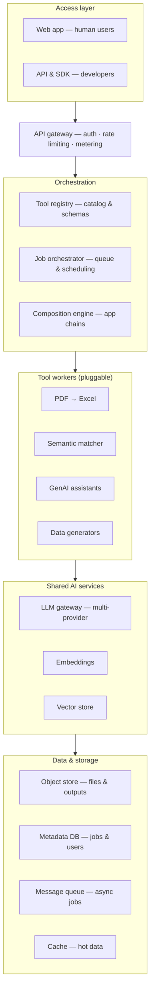
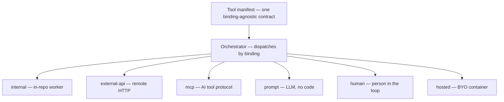
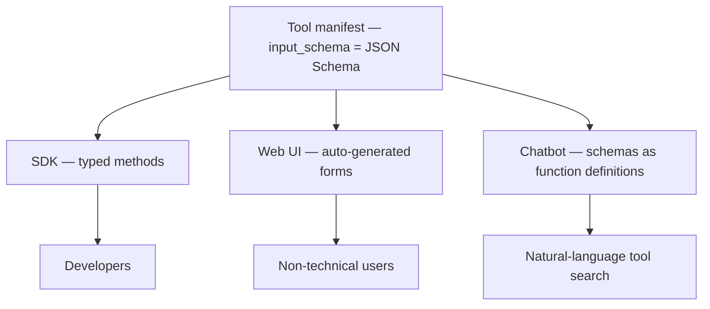
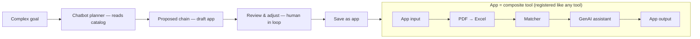
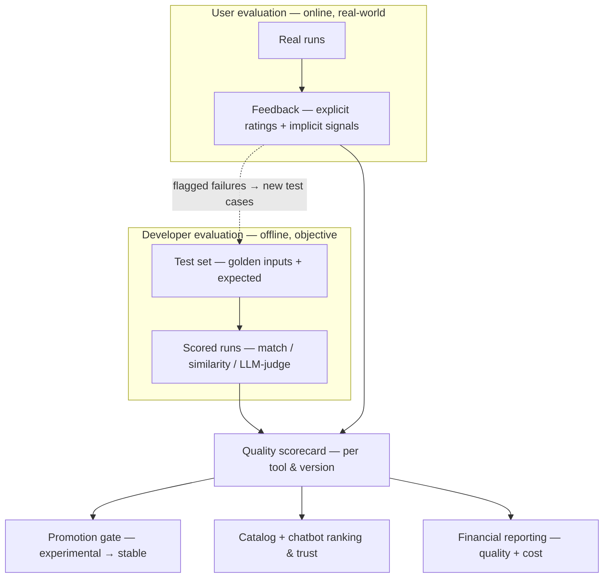
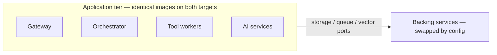
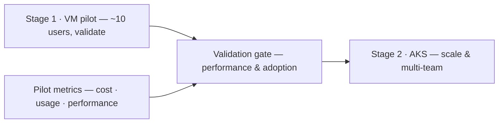

# Productivity Tools Platform — Solution Architecture

**Document type:** Solution architecture (high-level)
**Status:** Draft for review
**Date:** 11 June 2026
**Companion document:** `future-of-the-platform.md` — vision and roadmap for evolving this platform into a company-wide intelligence layer.
**Version:** 0.8 (draft)

---

## Contents

1. [Overview](#1-overview)
2. [High-level architecture](#2-high-level-architecture)
3. [Tool registry and the manifest contract](#3-tool-registry-and-the-manifest-contract)
4. [Internal tool-sharing model](#4-internal-tool-sharing-model)
5. [Consumption surfaces and app composition](#5-consumption-surfaces-and-app-composition)
6. [Performance evaluation (two-sided)](#6-performance-evaluation-two-sided)
7. [Deployment topology](#7-deployment-topology)
8. [Phased rollout](#8-phased-rollout)
9. [Metrics for the financial proposal](#9-metrics-for-the-financial-proposal)
10. [Key risks and caveats](#10-key-risks-and-caveats)
11. [Repository structure](#11-repository-structure)
12. [Summary](#12-summary)
- [Glossary](#glossary)
- [Changelog](#changelog)

---

## 1. Overview

This platform provides a catalog of productivity tools — such as a PDF-to-Excel extractor, a semantic matcher, GenAI assistants, and synthetic data generators — to an internal organisation. It serves two audiences from one core:

- **Developers**, who build tools and consume them through an SDK (~50 at full scale, including the tool authors themselves).
- **Non-technical employees**, who run tools through a web UI, assisted by a chatbot for discovery.

The platform is **internal only** — there are no external/third-party users. It is designed to run first on a single VM for a small pilot, then scale to Azure Kubernetes Service (AKS) using the *same container images*, with the migration expressed entirely as configuration rather than code changes.

> **Scope note.** "Internal only" describes this document's *build scope*, not the long-term vision. Productizing the platform for external, multi-tenant customers is a deliberate later phase covered in the companion `future-of-the-platform.md`. The current architecture intentionally omits the marketplace and multi-tenancy machinery that would only be needed then — but the manifest contract, metering, and port/adapter seams are designed so that phase is an extension rather than a rewrite.

### Guiding principles

| Principle | Why it matters |
|---|---|
| One core, multiple front doors | The web UI, SDK, and chatbot are all clients of the same internal API. No forked backends. |
| Tools as plugins, not hardcoded features | Every tool conforms to a declarative manifest contract and self-registers. Adding a tool touches no platform code. |
| Manifest is the single source of truth | One JSON Schema drives request validation, UI form generation, SDK type generation, docs, and chatbot tool definitions. |
| Async is first-class | Short tools return inline; heavy tools (PDF extraction, bulk generation) run as queued jobs. |
| Shared AI primitives | LLM gateway, embeddings, and vector store are built once and reused across all AI-driven tools and the chatbot. |
| Build once, deploy anywhere | Identical images on VM and AKS; only composition and backing-service implementations differ, selected by config. |

---

## 2. High-level architecture

The platform is organised into six layers. Dependencies flow top-to-bottom; tool workers also call the shared AI services and storage layers beneath them.



### Layer responsibilities

**Access layer.** Two front doors, one backend. The web app calls the same internal API exposed to developers, so the UI is effectively the first API consumer. This keeps both surfaces honest with each other.

**API gateway.** A single chokepoint for authentication (SSO), API keys, rate limiting, and usage metering. Metering is established here from day one because it is the foundation for cost attribution, quotas, and the eventual financial proposal.

**Orchestration.** The brain of the platform. The *tool registry* is the catalog where each tool declares its schema, execution mode, and resource needs. The *job orchestrator* validates requests, enforces permissions and quotas, and decides whether a tool runs inline or is queued for a worker pool. The *composition engine* expands a chained **app** into its constituent tool steps and drives the orchestrator for each, mapping every step's output to the next step's input (see Section 5.4). Because an app is itself a composite tool, it appears in the registry and is invoked through exactly the same path as a single tool.

**Tool workers.** Each tool is an isolated, independently deployable and scalable unit conforming to the registry contract. Tools do not call each other directly; they coordinate through the orchestrator.

**Shared AI services.** Common primitives reused by the semantic matcher, GenAI assistants, data generators, and the discovery chatbot: a multi-provider LLM gateway, an embeddings service, and a vector store.

**Data & storage.** Object store for heavy files (uploaded PDFs, generated spreadsheets), a metadata database for jobs/users/results, a message queue powering async execution, and a cache for hot reads.

### Cross-cutting concerns

Observability/tracing, secrets management, and tenancy/isolation touch every layer and are treated as their own track rather than retrofitted. A two-sided **evaluation service** (Section 6) is similarly cross-cutting: it coordinates batch runs through the orchestrator, scores them via the shared AI layer, and feeds quality signals back into the lifecycle, the catalog, and reporting.

---

## 3. Tool registry and the manifest contract

The registry is two things under one name: a **contract** (the spec every tool satisfies) and a **runtime service** (a queryable catalog plus a dispatch table the orchestrator reads).

### The tool manifest

Each tool publishes a declarative manifest at deploy time. Everything else — validation, UI forms, SDK methods, docs, billing, routing — is derived from it.

```yaml
id: data-eng/pdf-to-excel      # namespaced by owning team
version: 2.1.0                 # semver; multiple versions can be live at once
name: PDF Extractor
description: >                  # WHAT it does + WHEN to use it — drives chatbot discovery & planning
  Extracts tables from a PDF (including scanned) and returns them as an Excel file.
  Use when you have a PDF and need structured, spreadsheet-ready data.
keywords: [pdf, excel, tables, extraction, ocr]    # aids semantic search
examples:                                          # example prompts — discovery + planner few-shot
  - "turn this PDF invoice into a spreadsheet"
  - "pull the tables out of a scanned report"
kind: tool                     # tool | app (an app is a composite tool — see 5.4)
category: extraction
owner: data-engineering        # owning team (maps to CODEOWNERS)
maintainer: jane.doe           # contact when it breaks
visibility: stable             # planned | experimental | stable | deprecated

interface:
  input_schema:                # JSON Schema — single source of truth; describe EVERY field
    type: object
    required: [file_id]
    properties:
      file_id: { type: string, format: uuid, description: "the uploaded PDF to extract from" }
      pages:   { type: string, examples: ["1-5,8"], description: "page range; blank = all pages" }
      mode:    { type: string, enum: [tables, full_text], default: tables, description: "tables only or all text" }
  output_schema:
    type: object
    properties:
      result_file_id: { type: string, format: uuid, description: "id of the generated Excel file" }
      sheet_count:    { type: integer, description: "number of sheets produced" }

execution:
  mode: async                  # sync | async | streaming
  timeout_seconds: 600
  max_concurrency: 20
  resources: { cpu: 2, memory_mb: 4096, gpu: false }

dependencies: []               # e.g. [llm, embeddings] for AI tools
permissions:
  scopes: [files:read, files:write]   # system scopes the tool may exercise
  roles:                              # WHO may invoke this tool — see Access control below
    allow: [employee]                 # default for low-risk internal tools
    # deny: []                        # optional explicit deny
data_handling:                        # WHAT data classes may flow through this tool
  accepts: [public, internal]         # max sensitivity the tool may receive
  produces: [internal]                # sensitivity of its output
  pii: false
  phi: false
metering: { unit: per_page }   # how usage is counted for cost attribution
evaluation:                    # see Section 6 — two-sided performance evaluation
  test_set: tests/eval_set.yaml
  scorer: field_match          # field_match | embedding_similarity | llm_judge
  thresholds: { quality: 0.90, p95_latency_ms: 8000 }   # promotion gate
binding:
  type: internal               # internal | external-api | mcp | hosted | prompt | human
runtime: { worker_pool: cpu-extract }   # used by internal/hosted bindings
```

### Why the schema must be real JSON Schema

The `input_schema` feeds four consumers from one definition, so they never drift:

1. The **orchestrator** validates incoming requests against it before dispatch.
2. The **web UI** auto-generates an input form from it.
3. The **SDK** generates typed client methods from it.
4. **API docs** render from it.

### Writing manifests for discoverability

The chatbot finds and selects tools *entirely* from the manifest — there is no other signal — so two fields carry the weight and deserve real care:

- **`description`** — write it as purpose plus when-to-use, not a restated name. Discovery embeds the name, description, keywords, and examples and semantic-searches over them; a vague description returns the wrong tool. ("Extracts tables from a PDF; use when you need structured data" beats "PDF tool".)
- **Per-field schema descriptions** — during invocation and chain planning the LLM fills arguments from the input schema, so an undescribed field is a guess. Describe every property, including units and what "blank" means.

Optional `keywords` and `examples` (example prompts) further sharpen retrieval and give the planner few-shot signal. These are not documentation niceties — they are the mechanism by which the right tool gets picked, so they are part of the contract, reviewed like code.

### Tool granularity

The tool is the platform's unit of reuse, so how finely a tool is scoped determines how much leverage the platform actually delivers. The same de-identification or document-extraction tool should be able to sit inside many apps and solutions at once; that only works if tools are scoped at the right level.

The failure modes are at both extremes:

- **Too coarse** — a single `process-a-claim` tool that does intake, validation, adjudication, and notification internally. Nothing else can reuse its pieces, solutions can't recombine it, and it tends to grow private, un-composable logic. This is how a "platform" quietly decays into a set of monoliths.
- **Too fine** — a tool for every trivial step, so that composing anything useful means wiring dozens of nodes. Composition becomes tedious, chains become brittle, and the registry fills with noise.

The sweet spot is a **genuinely reusable capability** — one that more than one app or solution would plausibly want, expressible with a clear input/output contract. Good litmus tests when scoping a new tool:

- *Would a second, unrelated solution want this exact capability?* If yes, it's probably a tool. If it's only ever useful inside one workflow, it may belong as a step within an app instead.
- *Does it have a clean, stable contract?* A capability with well-defined inputs and outputs (extract tables from a document, de-identify PHI, match text against a code set, summarise a record) is a good tool. A capability whose interface only makes sense in the middle of one specific process is not.
- *Is it doing one thing?* If the description needs "and" to explain it ("validates *and* adjudicates *and* notifies"), it is likely several tools.

As a rule of thumb: capabilities that are reused across solutions belong in **tools**; orchestration that is specific to one workflow belongs in **apps** that chain those tools. When a tool is genuinely shared, improving it once improves every solution that depends on it — which is the entire economic argument for the platform, and it holds only while tools stay the atom rather than each solution growing its own private logic.

### Lifecycle

- **Registration** happens at deploy (via CI/CD), not at request time. Tools register themselves; nothing else in the system holds a hardcoded tool list.
- **Discovery** is a read API over the catalog — the UI gallery and the chatbot both query it.
- **Invocation** is where the manifest earns its keep: the orchestrator looks up the manifest, validates input against `input_schema`, checks `permissions` scopes, checks quota via `metering`, then runs inline or queues a job based on `execution.mode`. Dispatch then follows the tool's **binding** (see *Tool binding types* below) — an in-repo worker, an outbound call to an external API, an MCP server, and so on — invisibly to the caller.

**Versioning** is mandatory once developers depend on the platform: multiple versions may run simultaneously, clients pin a version, and deprecation has a defined window. **Namespacing** is by owning team (`data-eng/pdf-extractor`), which also encodes ownership.

> **Caveat:** A registry this declarative is excellent until a tool needs something the manifest cannot express (custom auth, unusual streaming, multi-step interactive flows). Decide early whether such tools get a controlled "escape hatch" or are disallowed. Drifting into a half-declarative, half-special-cased registry erodes the entire benefit.

### Tool binding types (internal, external, and more)

A tool's **binding** declares *how* it executes. The manifest contract — description, schemas, permissions, metering, evaluation — is identical across all bindings; only dispatch differs, so apps, the chatbot, the SDK, and evaluation treat every binding the same. A caller cannot tell whether a step ran in-repo or called out.

The two primary types:

- **`internal`** — code lives in the monorepo and runs on the platform's own workers. The default, fully under platform control.
- **`external-api`** — registered via an API contract (endpoint, auth, and the input/output mapping). The platform calls the endpoint rather than running the code; the contributor owns the implementation, uptime, and data handling. Registration reuses the publishing pipeline: the user supplies the contract and the platform validates reachability, authentication, and schema conformance (the declared test cases run against the live endpoint) before it goes `stable`.

The same model extends to further bindings:

- **`mcp`** — a tool exposed via the Model Context Protocol; worth adopting early, as it lets a large ecosystem of AI tools plug in under the same contract.
- **`prompt`** — a tool defined by a prompt template over the LLM gateway, no custom code — the cheapest way to author GenAI assistants.
- **`human`** — execution is a person: an approval, review, or manual entry routed to someone and returning a result. Especially valuable in health tech, where a chain may require a clinical sign-off step before proceeding.
- **`hosted`** — a contributor ships a container or function the platform runs in a sandbox (code out-of-repo, executed on-platform). Heavier; mainly relevant when contributors ship code without monorepo access, or when productizing.



> **Governance note (important for health tech).** `external-api` and `hosted` bindings break the "all tools run in our own infrastructure" assumption — data leaves the perimeter to a third party. Even internally, these need an endpoint allowlist, egress controls, and per-tool data classification; and before any regulated data (PHI) is sent out, a Business Associate Agreement and explicit governance sign-off. The permission scopes still apply — add a data-egress dimension to them.

### Data classification and egress control

The `binding.type` says *where* a tool executes; `data_handling` says *what data may flow through it*. Together they let the platform enforce that, for example, a public-only external API never sees PHI. This matters across all bindings but is the hard guarantee `external-api` needs.

Each tool declares two things:

- **`accepts`** — the maximum sensitivity it may *receive* as input.
- **`produces`** — the sensitivity of its *output* (often equal to or less than `accepts`, e.g. a de-identification tool that accepts PHI and produces internal).

Plus boolean tags like `pii` and `phi` for fast filtering and reporting.

**Suggested classes** (start small; add more only if needed):

| Class | Meaning | Examples |
|---|---|---|
| `public` | No restriction | Public docs, marketing copy |
| `internal` | Company-only, non-sensitive | Internal reports, code |
| `confidential` | Sensitive business data | Financials, contracts, employee records |
| `pii` | Personal identifying information | Names, emails, addresses |
| `phi` | Protected health information | Clinical data, claims tied to a patient |

**How the platform enforces it.** The orchestrator runs a check before every invocation: the *data class of the input* (carried with the request — set by the caller or inferred from its source) must satisfy the tool's `accepts`. A request carrying PHI into a tool whose `accepts` tops out at `internal` is **refused** with a clear classification-mismatch error, before any work runs and before any data crosses any boundary. In a chain, the engine propagates each step's `produces` as the next step's input class, so a chain that quietly walks PHI into a public-only external tool fails *at save time* — not at runtime.

**External tools specifically.** The `external-api` binding makes this the difference between safe and unsafe by design. The default for a freshly registered external tool is `accepts: [public, internal]` — it cannot receive `pii`/`phi`/`confidential` unless someone explicitly raises it. Raising the class on an external tool is a **governance action** requiring approval (and, for `phi`, a Business Associate Agreement on file).

### Access control (role-based)

`permissions.scopes` says *what the tool is allowed to do*; `permissions.roles` says *who is allowed to invoke it*. Most tools should be broadly available — the value of the platform comes from reuse — but some genuinely need to be restricted: a payroll adjustment tool to HR, a clinical decision-support tool to clinicians, an admin tool to platform operators.

Roles come from your identity provider (SSO) — the platform consumes them rather than inventing its own. A small, stable set is best: `employee`, plus a handful of functional roles (`hr`, `finance`, `clinician`, `provider-ops`, `platform-admin`). Avoid encoding individual usernames in manifests.

A tool declares:

- **`allow`** — roles permitted to invoke. Default is broad (`[employee]`) for low-risk tools.
- **`deny`** — optional explicit deny (rarely needed; allow-list is usually enough).

**Where enforcement happens.** Two places, with the same rule:

1. **At invocation,** the gateway/orchestrator checks the caller's roles against the tool's `allow`. Failure returns a clear authorization error before the tool runs.
2. **At surface generation,** the web UI catalog and the chatbot's discovery only *show* tools the user is allowed to invoke. Restricted tools aren't merely blocked at the door — they don't appear in search or chatbot suggestions for users who lack the role. This both improves UX and avoids leaking the existence of sensitive capabilities.

**For chains and apps.** An app's effective roles are the **intersection** (not union) of its steps' allowed roles — a chain is invocable only by someone authorised for every step in it. This is the safe default: it prevents privilege escalation by composition (you can't bypass HR's role gate by hiding a payroll-adjustment tool inside a public app). If a team genuinely wants a broader app that wraps a restricted step, the right answer is a thin proxy tool with its own `roles` declaration and an explicit governance review — not a permissive composition rule.

**Together: roles + data class as a two-dimensional gate.** Every invocation must satisfy both checks: the caller's roles are in `permissions.roles.allow`, *and* the input data class is in `data_handling.accepts`. The two are independent — a user with the right role can still be refused if the data is too sensitive for the tool, and vice versa. Both are visible on the tool's catalog page so authors and consumers can see the gate before trying it.

### Pre-registration: the `planned` state

A tool may be registered before it is built. A `planned` manifest carries intent — name, description, owning team, and draft input/output schemas — but has no implementation behind it. This lets a team **stake a claim** on a tool they intend to build so it appears in the catalog and chatbot discovery as "coming, owned by team X," directly countering the duplication failure mode (three teams independently building the same extractor because none knew the others intended to).

Rules for the `planned` state:

- The meta-schema relaxes for `planned` manifests: schemas may be draft/incomplete, and no image or test suite is required yet.
- The orchestrator **refuses to invoke** a `planned` tool — there is no worker — returning a clear "not yet available" response that names the owner to contact.
- It is discoverable and can accrue demand signals (requests/upvotes), which help owners prioritise.
- Promotion to `experimental` happens when an implementation and at least one test case land; promotion to `stable` additionally requires passing the developer evaluation thresholds without regression (see Section 6). The lifecycle is `planned → experimental → stable → deprecated`.
- A chained app (Section 5.4) may reference a `planned` tool; the app saves as a runnable-once-ready draft that cannot execute until the dependency ships.

---

## 4. Internal tool-sharing model

Because the platform is internal-only, the heavy machinery of a public marketplace (untrusted-code sandboxing, publisher verification, monetization, liability policy, public review queues) is **not required** — developers are authenticated employees on the same side as the platform team.

### What is kept, simplified, or dropped

| Concern | Decision for internal platform |
|---|---|
| Manifest contract | **Kept** — the core value; arguably more useful internally. |
| Versioning & namespacing | **Kept** — namespacing by team doubles as ownership. |
| Metering | **Kept**, repurposed for cost attribution and capacity planning, not billing. |
| Permission scopes | **Kept, lighter** — prevents honest mistakes (a read-only tool holding write credentials) more than malice. Paired with **roles** (who may invoke) and **data classification** (what data may flow through), forming a two-dimensional gate. |
| Publishing flow | **Simplified** to a CI/CD step: validate manifest + run declared tests, then it is live. |
| Visibility tiers | **Simplified** to a lifecycle: `planned → experimental → stable → deprecated`. |
| Sandboxing untrusted code | **Dropped for internal tools.** `external-api` and `hosted` bindings call out or run isolated code, so they need egress controls and, for regulated data, governance (see Section 3, *Tool binding types*). |
| Publisher identity, monetization, liability | **Dropped** — SSO already identifies everyone. |

### What is added for an internal platform

The internal failure mode is not a malicious tool — it is **duplication and abandonment**: multiple teams unknowingly building the same extractor, or a tool going stale after its author leaves. Mitigations:

- A genuinely browsable, searchable catalog.
- A required **owning team and maintenance contact** in every manifest.
- Freshness signals: last-updated, usage counts, and a maintained/unmaintained indicator.
- **Pre-registration (`planned` state):** teams declare intended tools before building them, so a planned tool is visible and claimed and others can rally behind it instead of duplicating it (see Section 3, *Pre-registration*).

---

## 5. Consumption surfaces and app composition

All three surfaces are projections of the same registry, generated from the same manifests. Beyond running individual tools, users can also **compose tools into apps** (Section 5.4), and the chatbot can propose those compositions.



### SDK (developers)

Generated from manifests, so each tool becomes a typed method with autocomplete and compile-time checking. The SDK hides the mechanics: SSO/token auth, async job polling, retries, and file upload/download to the object store. Tool authors consume this same SDK to test their own tools — dogfooding is the cheapest quality mechanism available.

### Web UI (non-technical users)

A JSON Schema → form renderer turns each manifest into a usable form automatically: text fields, dropdowns from enums, file-upload widgets for `file_id` inputs, and a submit → progress → download flow for async tools. New tools get a usable form with no frontend work; high-traffic tools can still receive hand-crafted UIs for polish.

### Chatbot (discovery, then optional invocation, then chain planning)

Three levels of ambition, deployed in order:

1. **Discovery (start here).** RAG over manifests — embed each tool's name, description, category, and examples into the existing vector store and semantic-search over them. Directly counters the "nobody can find the existing tool" problem and reuses infrastructure already built.
2. **Invocation (later, gated).** Because `input_schema` is already JSON Schema — the exact format LLM tool/function-calling expects — registered tools can be exposed to the LLM as callable functions with almost no extra work. The LLM selects a tool, fills arguments from the conversation, and the same orchestrator runs it.
3. **Chain planning (highest level).** For a complex goal that no single tool satisfies, the planner is given the catalog (tool descriptions and schemas) and composes an **ordered chain** — a draft app — mapping each step's output to the next step's input. The user reviews the proposal in the chain builder, re-adjusts it (swap a tool, reorder, retune parameters), and saves it as a new app. Saving promotes the draft into a registered composite tool (Section 5.4). Good tool descriptions matter here: they are now used not only for discovery but as the planner's raw material for composition.

> **Guardrail:** The chatbot is a client, not a bypass. Permission scopes, roles, data classification, and metering are enforced on its calls exactly as on direct API calls — and discovery itself is role-aware, so the chatbot only ever surfaces tools the user is allowed to invoke. Read-only discovery can be free-flowing; any tool with side effects or meaningful cost requires a human confirmation step before execution. A proposed chain is only ever *proposed* — it never runs, and is never saved, without explicit user review.

### 5.4 App composition (tool chaining)

Users can build a new **app** by chaining existing tools — the output of one feeding the input of the next. The central design decision: **an app is a composite tool.** Rather than a separate "app" entity, a chained app is modelled as a tool whose `kind: app` and whose implementation is a *chain definition* instead of code. It carries its own manifest (the app's overall input and output schema) and self-registers in the same catalog.

The payoff of this choice is that apps inherit everything tools already have, for free:

- Discoverability in the catalog and via the chatbot.
- A generated SDK method and an auto-generated web form.
- Metering, permissions, versioning, and the `planned → … → deprecated` lifecycle.
- The ability to be chained *into* other apps (apps compose recursively).



**The chain definition** lists ordered steps; each step references a tool `id` + pinned `version` and declares how its inputs are filled — from an app-level input, a constant, or a named output field of an earlier step. Example shape:

```yaml
kind: app
id: finance/invoice-digest
version: 1.0.0
visibility: stable
interface:
  input_schema:  { type: object, required: [file_id],
                   properties: { file_id: { type: string, format: uuid } } }
  output_schema: { type: object,
                   properties: { summary: { type: string } } }
chain:
  - step: extract
    tool: data-eng/pdf-to-excel@2.1.0
    inputs: { file_id: $app.file_id }            # from app input
  - step: enrich
    tool: ds/semantic-matcher@1.4.0
    inputs: { rows: $steps.extract.result_file_id }   # from prior step output
  - step: summarize
    tool: ai/genai-assistant@3.0.0
    inputs: { data: $steps.enrich.matched_file_id }
output: { summary: $steps.summarize.summary }    # final mapping
```

**The composition engine** (orchestration layer) executes the chain: it expands the app into steps, runs each through the existing job orchestrator, and passes data between steps as references (file ids flow via the object store, not inline). It handles async steps — a chain may span several queued jobs — plus error handling and partial-failure semantics.

Three properties make this safe and cheap to operate:

- **Static validation at save time.** Because every tool has a real JSON Schema, the engine checks each wiring — step N's output must satisfy the field of step N+1 it feeds — *before* the app is saved. Broken chains are caught at authoring time, not mid-run.
- **Scopes union, roles intersection, data class propagation.** An app's effective system scopes are the **union** of its steps' scopes (the app needs everything every step needs). Its allowed roles are the **intersection** of its steps' roles — a chain is invocable only by someone authorised for every step, which prevents privilege escalation by composition. And the engine propagates each step's `produces` as the next step's input class, so a chain that walks regulated data into a tool that doesn't `accepts` it fails at save time.
- **Metering rolls up.** Cost is attributed per step and aggregated to the app, so app-level usage and cost appear in the same reporting as single tools.

**Scope guidance.** Start with **linear chains** (output → input). A general branching DAG (fan-out/fan-in, conditionals, loops) is a natural later extension but adds real complexity to validation, the builder UI, and cost control — defer it until linear chains prove the model. **Pin tool versions** in a chain so an upstream tool's `v2` cannot silently break a saved app; surface a prompt to the app owner when a pinned dependency is deprecated.

---

## 6. Performance evaluation (two-sided)

Tool and app quality is measured from two complementary sides. **Developer evaluation** is offline, controlled, and objective — does the tool meet spec on a curated test set, before release? **User evaluation** is online, real-world, and subjective — does it actually help on the messy inputs people really submit, after release? A tool can pass the first and fail the second; the gap between them is itself a signal, and closing it is the point of the loop.

Crucially, this needs no new execution machinery. An evaluation is a batch of tool runs plus scoring, so it rides the existing job orchestrator and tool workers; AI-based scoring reuses the shared AI layer; scorecards live in the metadata DB and object store; feedback is collected through the gateway. The evaluation service is a coordinator over components that already exist.



### 6.1 Developer evaluation (offline)

The owning team supplies a test set — golden inputs paired with expected outputs or assertions — generalising the `test_cases.yaml` already in the tool scaffold from pass/fail into graded quality. Scoring method depends on the tool:

- **Deterministic tools** (PDF→Excel): exact or fuzzy field-level matching, extraction precision/recall.
- **Non-deterministic tools** (matcher, GenAI assistants, generators): can't be exact-matched. Score with embedding similarity against references (reuses the embeddings service), or LLM-as-judge against a rubric (reuses the LLM gateway), with human spot-checks for high-stakes cases.

Each run produces a per-version scorecard — quality score, latency p50/p95, cost per run, error rate. This is the **promotion gate**: a version moves `experimental → stable` only when it clears its thresholds and does not regress against the prior version. Evals run in CI on every change and on demand.

### 6.2 User evaluation (online)

Real runs collect both explicit and implicit feedback:

- **Explicit:** a thumbs up/down or rating on a result, and an optional "was this correct?" flag.
- **Implicit:** did the user keep the output, edit it, re-run, or abandon it? Adoption and retention per tool.

Aggregated per tool and version, this feeds the catalog trust signals and the chatbot's ranking (it should prefer higher-rated tools when discovering or composing chains), and it exposes the real-world input distribution the curated test set missed.

### 6.3 How the two sides connect

The sides are complementary, not redundant: developer eval certifies against a known standard before release; user eval reveals real-world performance after it. The closing loop is that **user-flagged failures become new developer test cases**, so the offline suite tracks reality over time instead of drifting into a static guess. Apps (composite tools) are evaluated the same way — an end-to-end test set on the chain plus user feedback on app runs — with quality attributable per step so a weak link in a chain is visible.

### 6.4 What to watch

- **Non-deterministic scoring is imperfect.** LLM-as-judge has its own reliability limits; combine it with human review for high-stakes tools, and sample rather than judge every run (judging consumes LLM spend).
- **Test sets rot and overfit.** Evolve them continuously, seeded from the user-flagged failures above.
- **User feedback is sparse and negativity-biased.** Weight implicit signals and avoid over-reading small samples.
- **Eval data can be sensitive.** Test sets and flagged examples inherit the same per-team isolation and governance as everything else.

---

## 7. Deployment topology

The application tier (gateway, orchestrator, tool workers, AI services) is **identical** on both targets. Only the *composition* and the *implementation of stateful backing services* change, selected by configuration. Each stateful dependency sits behind a small port/adapter interface with two implementations.



### Backing-service mapping

| Dependency | VM profile (self-hosted) | AKS profile (managed Azure) |
|---|---|---|
| Object store | MinIO container | Azure Blob Storage |
| Metadata DB | PostgreSQL container | Azure Database for PostgreSQL |
| Cache | Redis container | Azure Cache for Redis |
| Message queue | Redis / local | Azure Service Bus |
| Vector store | pgvector / Qdrant container | Azure AI Search (or managed pgvector) |
| Secrets | env file | Azure Key Vault (CSI driver) |
| LLM provider | configured endpoint | Azure OpenAI |
| Container images | local Docker / ACR | Azure Container Registry |
| Composition | Docker Compose | Helm chart / Kustomize |
| Worker scaling | fixed replicas | KEDA autoscaling on queue depth |

The async job model pays off on AKS: KEDA scales tool workers on queue depth — idle at zero, bursting when a flood of extractions lands. On the VM the same worker is simply a fixed set of replicas. Same container, two scaling stories.

### Invariants that keep this clean

- **Stateless app tier** — no local disk assumptions, no in-process job state; all durable state lives in backing services.
- **One image set** in ACR consumed by both profiles; the VM gets no special build.
- **Fully externalized config** — the only difference between a laptop and production is a values file.
- **No code branching on environment** — the moment code asks "am I on a VM or AKS?", the platform has forked. Keep divergence in config and composition, never in code.
- Use the **S3-compatible API** for storage (MinIO ↔ Blob) so the swap is trivial.

---

## 8. Phased rollout



### Stage 1 — VM pilot (~10 users)

A Docker Compose stack on a single host: app containers plus self-hosted backing services. Purpose: validate value and performance cheaply. Even at this small scale, enforce the invariants in Section 7 so that scaling later is a redeploy, not a rewrite. Treat the VM as cattle, not a pet — no manual SSH tweaks that diverge from the repo.

### Validation gate

Decide whether to scale based on real pilot evidence: is the platform actually used, by whom, is it fast and reliable enough, and what does it cost to run.

### Stage 2 — AKS scale-up (multiple teams)

Deploy the Helm chart to AKS pointing at managed Azure services, migrate data (PostgreSQL dump → Azure Database for PostgreSQL; bucket copy MinIO → Blob), and cut over. Same images throughout. Opens the platform to other teams for contribution under the internal tool-sharing model.

> **Caveat:** The single VM has no redundancy and a hard ceiling. It is ideal for development, demos, small pilots, and air-gapped installs — but a 50-developer production load with bursty AI workloads belongs on AKS. Do not stretch a successful pilot to 30 users on the VM "because it works"; that is precisely the point to have already moved to AKS.

---

## 9. Metrics for the financial proposal

The business case follows the pilot, so Stage 1 must *generate* the evidence rather than estimate it after the fact. The gateway metering layer is the instrument. Capture from day one:

- **Usage per tool and per user** — which tools are adopted, by whom.
- **Compute and LLM cost attributed per tool** — the largest variable cost and the first question finance will ask.
- **Latency and reliability per tool** — feeds the validation gate.
- **Active-user trends** over the pilot period.
- **Quality and satisfaction scores** from the two-sided evaluation (Section 6) — objective scorecard quality alongside real user ratings, so the case rests on demonstrated value, not just usage volume.

This data does double duty: it drives the validation-gate decision, and it becomes the cost-and-value model in the AKS proposal — "10 users generated this much usage at this cost-per-run; here is the projected curve at 50+ users across teams." A proposal grounded in real pilot numbers is far more credible than one built on estimates.

---

## 10. Key risks and caveats

| Risk | Mitigation |
|---|---|
| Registry escape hatches proliferate | Decide the policy early; keep non-conforming tools rare and explicit. |
| Environment-specific code creeps in | Enforce config-only divergence; review for any "VM vs AKS" branching. |
| Manual changes on the pilot VM | Treat the VM as reproducible infrastructure; no hand-tweaks. |
| Tool duplication / abandonment | Searchable catalog, mandatory owner + freshness signals. |
| Chatbot invoking side-effecting tools unsafely | Enforce scopes/metering on chatbot calls; human confirmation for actions. |
| Chatbot proposes costly or runaway chains | Chains are proposed only; user reviews/saves explicitly; cost preview before run; step/loop limits. |
| Chained app breaks when an upstream tool changes | Pin tool versions in the chain; prompt the app owner on deprecation of a dependency. |
| `planned` tools never get built | Required owner + demand signals; periodic review of stale `planned` entries. |
| LLM-as-judge scoring is unreliable | Human review for high-stakes tools; sample rather than judge every run; combine with reference metrics. |
| Test sets overfit or go stale | Seed new cases from user-flagged failures; review test sets each release. |
| User feedback is sparse / biased | Weight implicit signals; avoid decisions on small samples. |
| External-API tool sends data to a third party | Endpoint allowlist + egress controls; per-tool data classification; BAA and governance sign-off before any regulated data leaves the perimeter. |
| Data-class mismatch sneaks past authoring | Class declared per tool (`accepts`/`produces`) and propagated through chains at save time; invocation refused on mismatch, before any work runs. |
| Role drift in the identity provider | Keep the role set small and stable; review per-tool `roles` on a schedule; tie role definitions to SSO groups rather than individuals. |
| Over-restriction kills adoption | Default to broad `[employee]` access for low-risk tools; only restrict where the tool genuinely warrants it; surface required roles on the catalog page. |
| External-API tool is slow, down, or changes its contract | Timeouts, retries, and circuit-breakers; verify the contract on registration and on a schedule; isolate failures so one external tool can't stall a chain. |
| Pilot success overruns VM capacity | Move to AKS at the validation gate, not after the ceiling is hit. |

---

## 11. Repository structure

The platform is developed in a **single repository (monorepo)**. The decision is driven by the architecture itself: the manifest is a *generative* source of truth, so a schema change and its regenerated SDK, UI form, docs, and chatbot definition should land in one atomic, reviewable commit. Splitting these across repos would create a versioning dance between a contract and its consumers that buys nothing for an internal platform. A small team (~10 growing to ~50), shared libraries, one CI/CD pipeline, and better discoverability all reinforce the choice.

A monorepo is **not** a monolith: each tool and service still builds its own image and deploys independently — repo boundary and deployment boundary are separate concerns. Two disciplines preserve that:

- **Affected-only CI** — a build system that computes what changed and only builds/tests/deploys those packages (Nx, Turborepo, Bazel, or a language-native equivalent). Decide this early; retrofitting it is painful.
- **Per-path ownership** — a `CODEOWNERS` file maps each tool directory to its owning team, mirroring the manifest's `owner` field so a shared repo never means diffuse responsibility.

```
platform/
├── contracts/                  # THE source of truth — everything generates from here
│   ├── manifest.schema.json    #   meta-schema every tool manifest validates against
│   └── shared-schemas/         #   common types (file_id, pagination, errors)
│
├── core/                       # the platform itself
│   ├── gateway/                #   auth · rate limiting · metering
│   ├── registry/               #   catalog service (discovery API)
│   ├── orchestrator/           #   validate → dispatch → sync/async decision
│   └── job-runner/             #   worker harness that tools build on
│
├── ai-services/                # shared AI layer (built once, reused)
│   ├── llm-gateway/            #   multi-provider abstraction
│   ├── embeddings/
│   └── vector-store/
│
├── libs/                       # shared libraries used across services
│   ├── storage/                #   port + adapters (MinIO ↔ Blob, S3 API)  ← VM/AKS swap
│   ├── queue/                  #   port + adapters (Redis ↔ Service Bus)
│   ├── auth/                   #   SSO / token helpers
│   ├── telemetry/              #   tracing + metering helpers
│   └── manifest/               #   parse / validate (used by registry AND ci)
│
├── tools/                      # the pluggable tools — namespaced by owning team
│   ├── data-eng/
│   │   └── pdf-to-excel/
│   │       ├── manifest.yaml   #   declares schema, execution mode, scopes, metering
│   │       ├── src/
│   │       └── tests/          #   declared test cases CI runs against the schema
│   ├── ds/
│   │   └── semantic-matcher/
│   └── _template/              #   scaffold for new tools — lowers contribution barrier
│
├── sdk/
│   ├── generator/              #   reads manifests → emits typed clients
│   └── packages/               #   generated SDK(s), e.g. python / typescript
│
├── web/                        # schema-driven form renderer + catalog + chatbot UI
├── chatbot/                    # discovery (RAG over manifests), later gated invocation
│
├── deploy/
│   ├── compose/                #   Stage 1 — VM (docker-compose)
│   ├── helm/                   #   Stage 2 — AKS (chart)
│   └── config/                 #   profiles: vm.values, aks.values  ← the only VM/AKS diff
│
├── docs/                       # rendered from schemas + handwritten
├── scripts/                    # codegen entrypoints, dev tooling
└── ci/  (or .github/workflows/) + CODEOWNERS
```

A few placements are load-bearing rather than arbitrary:

- `contracts/` sits at the root because it is upstream of everything — the registry, the SDK generator, and the CI validator all read it.
- The VM-vs-AKS swappability lives **entirely** in `libs/storage`, `libs/queue` (port/adapter pattern) and `deploy/config` (which adapter, which endpoints). No other directory knows which environment it is running in.
- `tools/` namespaced by team maps one-to-one onto the manifest `owner` field and `CODEOWNERS`, so ownership is consistent across structure, manifest, and code review.

> **Forward-looking escape hatch:** if a contributing team later genuinely needs its own release cadence and repo, the manifest contract allows a tool to live out-of-tree and register remotely (the federated model). Choosing a monorepo now does not permanently forbid out-of-tree tools later; it just defers that coordination cost until something demands it.

### 11.1 New-tool scaffold (`tools/_template/`)

Contributing a tool is close to fill-in-the-blanks. A team copies `_template/` to `tools/<team>/<tool>/` and completes a checklist; CI validates the manifest, runs the declared tests, builds the image, and registers the tool on merge. The scaffold contains:

```
_template/
├── manifest.yaml        # fill-in-the-blanks contract (schema, execution, scopes, metering)
├── src/
│   └── handler.py       # entrypoint: handle(input, ctx) — uses ctx, never imports infra
├── tests/
│   ├── test_cases.yaml  # declared cases CI runs against the schema
│   └── test_handler.py  # unit test using in-memory fake_context()
└── README.md            # contribution checklist
```

The handler contract is deliberately narrow. The job-runner harness validates the request against `input_schema`, calls `handle(input, ctx)`, then validates the return value against `output_schema`. The handler reaches every platform service — storage, LLM, embeddings, logging/metering — **only** through the injected `ctx`, never by importing infrastructure clients directly. That single rule is what makes a tool portable across the VM and AKS targets unchanged.

```python
from platform_sdk.tool import ToolContext, tool

@tool   # registers handle() as this tool's entrypoint
def handle(input: dict, ctx: ToolContext) -> dict:
    # input is already validated against input_schema
    # raw = ctx.storage.get(input["file_id"])     # object store
    # answer = ctx.llm.complete(prompt)            # LLM gateway
    # ctx.logger.info("processed", pages=n)        # telemetry + metering
    return {                                       # must match output_schema
        # "result_file_id": ctx.storage.put(result_bytes),
    }
```

**Contribution checklist (from the scaffold README):** set the manifest identity fields (`id`, `name`, `description`, `owner`, `maintainer`); define `input_schema` and `output_schema`; choose `execution.mode`; declare `dependencies`, least-privilege `permissions.scopes`, and `metering.unit`; implement `handler.py` using `ctx`; add at least one case to `test_cases.yaml`; add the team to `CODEOWNERS`; open a PR. From the manifest alone the tool gets request validation, a typed SDK method, an auto-generated web form, rendered docs, and chatbot discovery.

---

## 12. Summary

A single manifest-driven registry feeds three generated surfaces (SDK, web UI, chatbot) over one orchestrating core, backed by shared AI primitives and swappable storage. Tools can be **pre-registered** in a `planned` state to stake a claim before they are built, and can be **chained into apps** — where an app is simply a composite tool that inherits all the registry machinery, with chains statically validated against the tools' JSON Schemas. The chatbot grows from finding tools, to invoking them, to **proposing whole tool chains** for complex goals that users review and save as new apps. Quality is measured from two sides — a developer test set offline and real user feedback online — feeding a per-version scorecard that gates promotion, ranks the catalog, and strengthens the financial case. The same container images run as a Docker Compose stack on a VM for the pilot and as a Helm-deployed workload on AKS at scale, with the difference confined to configuration. The pilot is instrumented from day one so its metrics both gate the scale-up decision and underwrite the financial proposal.

---

## Glossary

| Term | Meaning |
|---|---|
| **Tool** | An atomic, reusable capability with a manifest and an input/output schema. The unit of composition and reuse. |
| **Binding** | How a tool is executed or reached — internal worker, external API, MCP server, hosted sandbox, prompt, or human task. Independent of the manifest contract. |
| **Internal tool** | A tool whose code lives in the repo and runs on the platform's own workers. |
| **External tool** | A tool registered via an API contract; the platform calls an external endpoint rather than running the code. |
| **Data class** | The sensitivity level of data flowing through a tool: `public`, `internal`, `confidential`, `pii`, `phi`. Declared per tool as `accepts`/`produces`. |
| **Egress control** | Enforcement that data above a declared class cannot reach a tool (especially `external-api`/`hosted`) that may not handle it. |
| **Role** | An identity-provider group used to gate who may invoke a tool: `employee`, `hr`, `finance`, `clinician`, `provider-ops`, `platform-admin`, etc. |
| **App** | A composition of tools (a chain) that is itself registered as a composite tool. |
| **Solution** | A larger, branded composition of tools and apps for a whole domain (e.g. HRX), served as a single offering. See the companion document. |
| **Manifest** | The declarative descriptor for a tool or app: identity, schemas, execution, permissions, metering, evaluation. The single source of truth. |
| **Composition engine** | Orchestration component that runs an app's chain, mapping each step's output to the next step's input. |
| **GenAI assistant** | An LLM-powered *tool* (e.g. summarisation, generation). A tool category — distinct from an autonomous "agent". |
| **Agent (autonomous)** | A future concept (companion document): goal-driven orchestration that plans and executes across tools under supervision. Not the same as a GenAI assistant tool. |
| **Scorecard** | A per-version record of quality, latency, cost, and error rate from evaluation; gates promotion. |
| **Lifecycle states** | `planned` (pre-registered, not yet built) → `experimental` → `stable` → `deprecated`. |
| **Port/adapter** | An interface plus swappable implementations (e.g. storage: MinIO ↔ Azure Blob) that enables the VM↔AKS swap. |
| **Metering** | Per-run usage capture for cost attribution today, and the basis for billing in the productized future phase. |
| **Tenant** | An isolated customer or department boundary; relevant in the productized, multi-tenant future phase. |

---

## Changelog

| Version | Summary |
|---|---|
| 0.1 | Initial high-level architecture: six layers, tool registry and manifest contract, three consumption surfaces. |
| 0.2 | Internal tool-sharing model; chatbot discovery and invocation. |
| 0.3 | Deployment topology (VM↔AKS, port/adapter); phased rollout; metrics for the financial proposal. |
| 0.4 | App composition (tool chaining); chatbot chain planning; review-and-adjust flow. |
| 0.5 | Two-sided performance evaluation; pre-registration (`planned` state); repository structure and new-tool scaffold. |
| 0.6 | Tool granularity guidance; manifest discoverability guidance and richer example; consistency pass (subsection numbering, manifest fields, internal-vs-external scope note); "GenAI assistants" rename to disambiguate from autonomous agents; table of contents, glossary, and this changelog. |
| 0.7 | Tool binding types: `internal` and `external-api` (register via API contract), plus `mcp`, `prompt`, `human`, and `hosted` as supported bindings; dispatch-by-binding in the orchestrator; egress/governance caveats for external bindings. |
| 0.8 | Data classification and egress control (`data_handling.accepts`/`produces`, default-deny for raising external-tool class, in-chain propagation at save time); role-based access (`permissions.roles`) with role-aware discovery in catalog and chatbot; app-composition rule refined — scopes union, roles intersection, data class propagation. |
